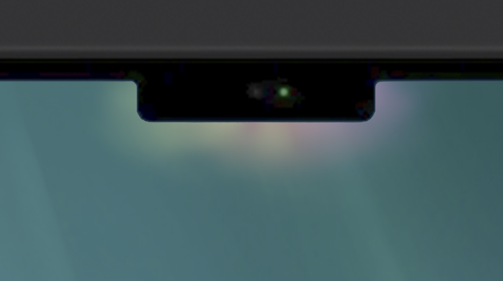
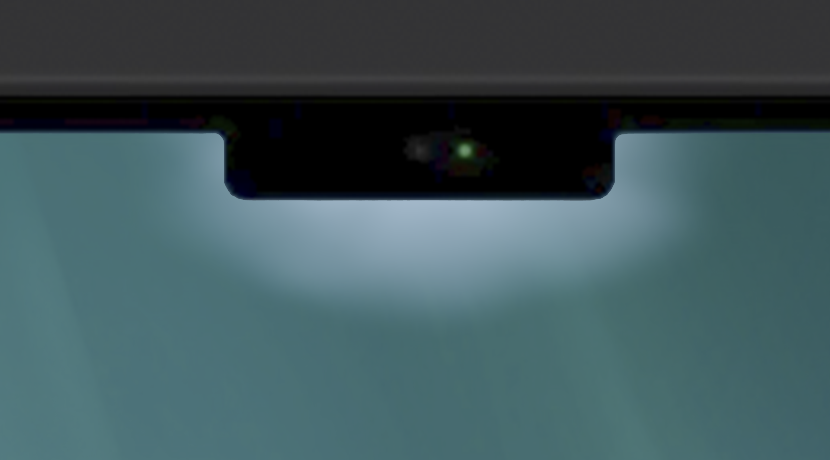
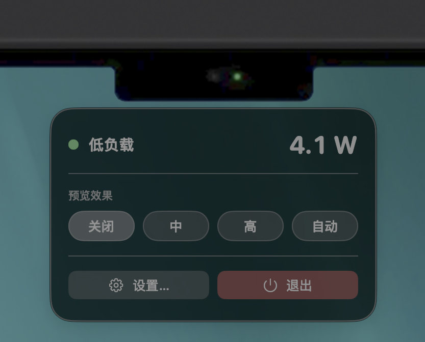
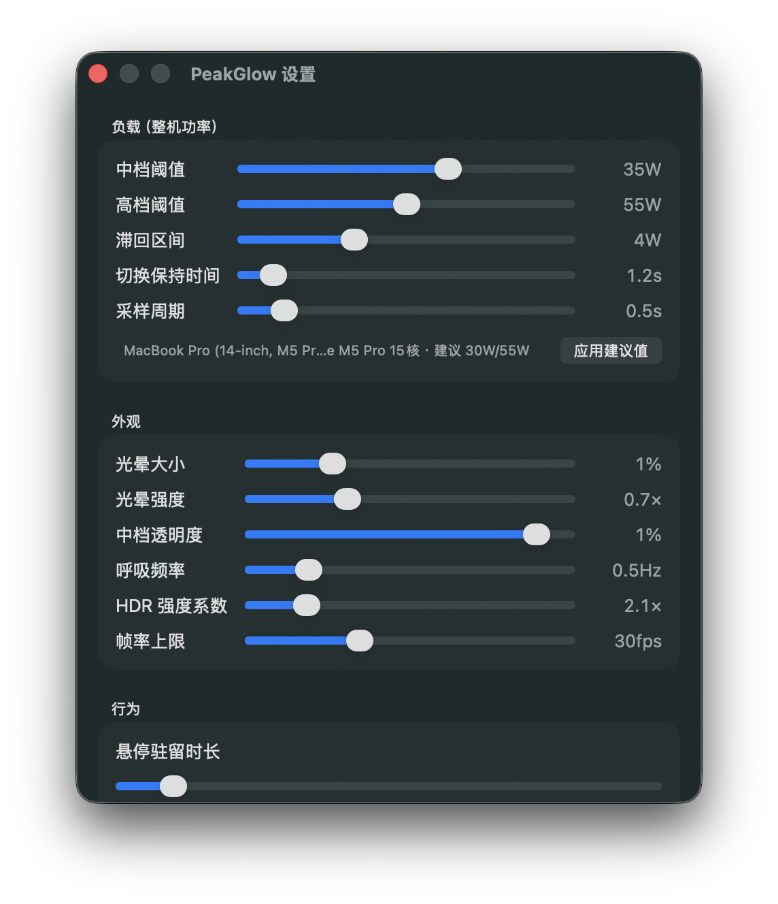

# PeakGlow

> 刘海会说谎，但功率不会。—— 让你的 MacBook 刘海在整机高负载时发光提醒

> 本工具完全由AI开发，人类在其中只贡献了钱包和指手画脚

[](https://developer.apple.com/macos/)
[](https://developer.apple.com/silicon/)
[](LICENSE)

PeakGlow 是一款 macOS 菜单栏常驻小工具（好吧，其实它连菜单栏都不占）：实时读取整机功耗，当负载超过阈值时，在 MacBook 刘海周围渲染柔和的彩虹光晕；负载进一步升高时，光晕变为带 **HDR 峰值亮度**的鲜艳蓝色并伴随呼吸脉冲。

| 负载 | 效果 |
|---|---|
| 低/关 | 无任何视觉提示（零渲染、零开销） |
| 中 | 刘海周围缓慢流动的彩虹光晕（Apple Intelligence 极光风，带 HDR） |
| 高 | 鲜艳蓝色光晕 + HDR 峰值亮度 + 0.5Hz 呼吸脉冲 |

<p align="center">
<table>
  <tr>
    <td align="center"><br><sub>中等负载‑彩虹光晕</sub></td>
    <td align="center"><br><sub>高负载‑蓝色呼吸光晕</sub></td>
    <td align="center"><br><sub>刘海悬停控制气泡</sub></td>
    <td align="center"><br><sub>参数设置面板</sub></td>
  </tr>
</table>
</p>

## 特性

- **零界面侵入** —— 无 Dock 图标、无菜单栏图标。鼠标移到刘海停留 0.4s 呼出控制气泡（预览 / 设置 / 退出）
- **真实整机功耗信号** —— 直接读取 SMC `PSTR` 传感器（与开源工具 stats 同源方案），无需 root、无需任何系统权限弹窗
- **机型自适应** —— 自动识别 MacBook Air / Pro 14" / Pro 16"（含芯片与核心数），首次启动自动写入匹配的阈值：
  | 机型 | 中档阈值 | 高档阈值 |
  |---|---|---|
  | MacBook Air | 13 W | 19 W |
  | MacBook Pro 14" | 30 W | 55 W |
  | MacBook Pro 16" | 30 W | 55 W |
- **真 HDR 渲染** —— Metal `rgba16Float` + extended linear sRGB + EDR headroom 自适应，XDR 屏幕 blue 光可达 SDR 白之上；不支持的屏幕自动回退鲜艳 SDR
- **防误触** —— 5 样本滑动平均 + 滞回 + 保持时间，瞬时功率尖峰不会触发动画
- **省电** —— 低负载时渲染完全停止，空闲自身 CPU 占用 ≈ 0

## 系统要求

- MacBook（带刘海的内建显示器）
- Apple Silicon
- macOS 14.0+
- HDR 效果需要 XDR 显示屏（MacBook Pro 14"/16"）；Air 上自动回退 SDR

## 构建与安装

```bash
git clone https://github.com/yourname/PeakGlow.git
cd PeakGlow
xcodegen generate          # 需要: brew install xcodegen
open PeakGlow.xcodeproj    # Xcode 中 ⌘R 运行，或：
xcodebuild -project PeakGlow.xcodeproj -scheme PeakGlow -configuration Release build
```

产物在 `DerivedData/.../Build/Products/Release/PeakGlow.app`，拖入 `/Applications` 即可。可在设置中开启"登录时启动"。

## 使用

1. 启动后无任何图标 —— 这是正常的
2. **鼠标移到屏幕顶部刘海（摄像头区域）停留约 0.4s**，呼出控制气泡
3. 气泡内容：当前档位与实时功率、效果预览（关闭 / 中 / 高 / 自动）、设置、退出
4. 拖动设置中的阈值滑杆可实时观察效果变化

## 工作原理

```
SMC PSTR (整机功率 W)
   │  IOKit 用户态调用（AppleSMC，selector 2 两步读取）
   ▼
5 样本滑动平均 ──► 滞回状态机 (低/中/高 + 保持时间)
                        │
                        ▼
              GlowWindow（刘海顶部 720×210pt 透明窗口）
              └─ CAMetalLayer + EDR，主线程 Timer 驱动
                 ├─ 中档：HSV 彩虹 + fbm 噪声流动，×0.5 EDR 增益
                 └─ 高档：蓝色 ×满 EDR 增益 + 0.5Hz 呼吸脉冲
```

- 功率读取：`IOServiceMatching("AppleSMC")` → `readKeyInfo(9)` 查询 → `readBytes(5)` 读取，`flt` 类型小端解析
- 刘海定位：`NSScreen.auxiliaryTopLeftArea / auxiliaryTopRightArea` 精确计算刘海矩形
- 悬停热区：仅覆盖刘海本身的透明窗口，不遮挡两侧菜单栏图标
- 全屏处理：窗口不含 `.fullScreenAuxiliary`，原生全屏空间中系统级不可见

## 设置项一览

| 分组 | 项目 |
|---|---|
| 负载 | 中/高档功率阈值、滞回区间、切换保持时间、采样周期 |
| 外观 | 光晕大小（等比）、强度、透明度、呼吸频率、HDR 强度系数、帧率上限 |
| 行为 | 悬停驻留时长、登录时启动 |

## 已知限制

- "整机功耗"来自 SMC 传感器，适配器充电功率的瞬时波动可能短暂抬升读数（滑动平均已大幅缓解）
- 无刘海机型（外接屏使用/老机型）不显示光晕，仅气泡可用
- 未签名分发时首次运行需右键打开（或 `xattr -cr` 去除隔离属性）

## 致谢

- [exelban/stats](https://github.com/exelban/stats) —— SMC 读取实现参考

## License

MIT
